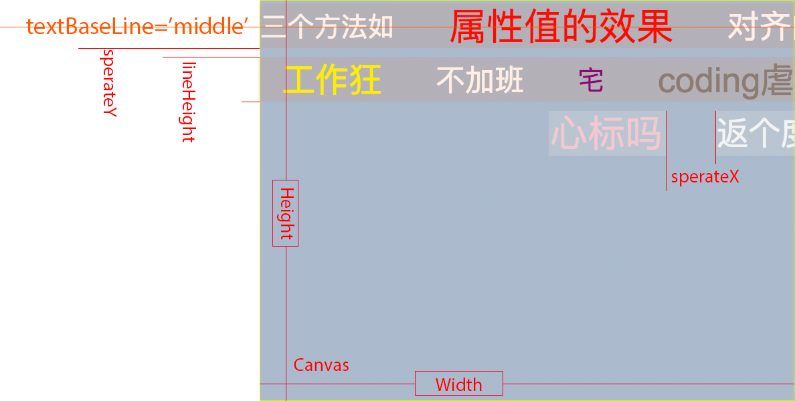

# barrager
这是一个通过canvas实现的弹幕器，只需传一个canvas标签的ID，即可生成。

兼容了ratina屏，避免在高清屏下模糊的现象；

可控制循环滚动字幕；

### 图解


### 使用方法

> new Barrager(options);

### 参数说明
> 有默认值的都是必需的参数

|    name    |  type   |      desc       |  example  |
| :--------: | :-----: | :-------------: | :-------: |
|   elemId   | String  |    canvas的id    | 'barrage' |
|   height   | Integer | 画布的高，单位px，默认300 |    300    |
|   width    | Integer | 画布的宽，单位px，默认400 |    400    |
|  sperateX  | Integer |    列间隔，默认40     |    40     |
|  sperateY  | Integer |    行间隔，默认40     |    40     |
| lineHeight | Integer |     行高，默认80     |    80     |
|   toLeft   | Boolean |  移动方向是否向左，默认向右  |   false   |
|    fps     | Integer |    绘制帧率，默认50    |    50     |
|    loop    | Boolean |   是否开启循环，默认关闭   |   true    |


* 还有一个重要参数texts，指定弹幕的自定义信息，弹幕文本及行滚动时间，如下格式：

```
[ // 弹幕文本信息
  {
    text: [
      { style: '28px Arial', color: 'red', content: '属性值的效果' },
      { style: '24px arial', color: 'white', content: '对齐的方法总结' },
      { style: '24px arial', color: 'blue', content: '激情' },
      { style: '26px arial', color: 'lightblue', content: '测量的文本' },
      { style: '20px arial', color: 'white', content: '绘图环境提供三个方法如' }
    ],
    time: 10,           // 文本移动时间， 默认10
  },
  {
    text: [
      { style: '25px arial', color: 'yellow', content: '工作狂' },
      { style: '22px arial', color: 'white', content: '不加班' },
      { style: '20px arial', color: 'purple', content: '宅' },
      { style: '26px arial', color: 'grey', content: 'coding虐你千百遍' },
      { style: '24px arial', color: 'white', content: '脚本之家' }
    ],
    time: 8,
  },
  {
    text: [
      { style: '28px arial', color: 'pink', content: '心标吗' },
      { style: '24px arial', color: 'white', content: '返个度量' }
    ],
    time: 7,
  },
]
```
